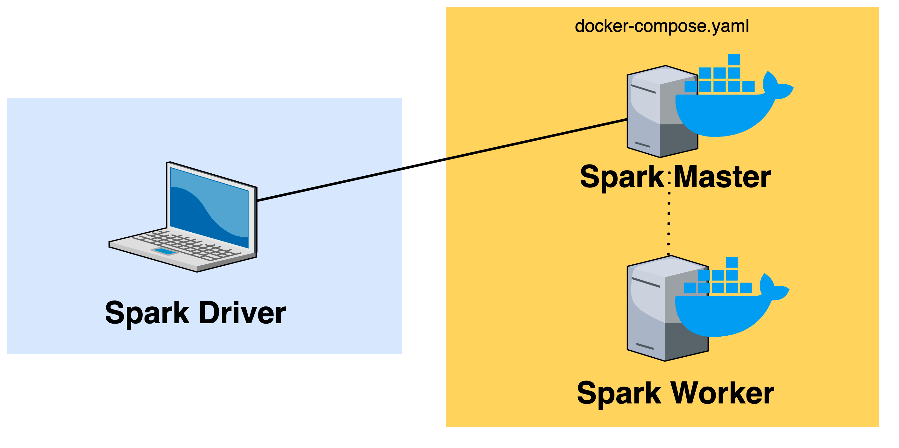
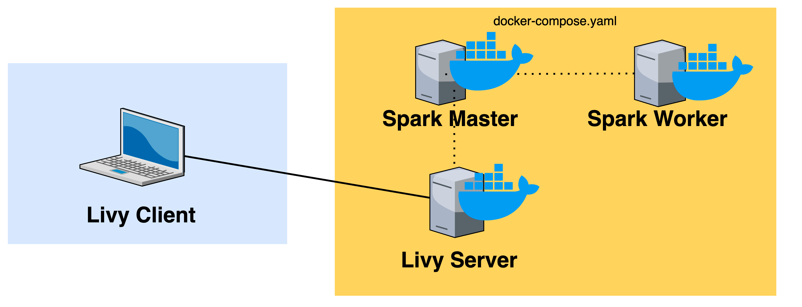

# spark-livy-on-airflow-workspace

A workspace to experiment with Apache Spark, Livy, and Airflow in a containerized Docker environment.

## Prerequisites

We'll be using the below tools and versions:

| Tool | Version | Notes |
| -----| ------- | -------- |
| Java 8 SDK | `openjdk version "1.8.0_282"` | Installed locally in order to run the Spark driver (see `brew` [installation options](https://devqa.io/brew-install-java/)).
| Scala | `scala-sdk-2.11.12` | Running on JetBrains IntelliJ.
| Python | `3.6` | Installed using `conda 4.9.2` .
| PySpark | `2.4.6` | Installed inside `conda` virtual environment.
| Livy | `0.7.0-incubating` | See release history [here](https://livy.apache.org/history/).
| Airflow | `1.10.14` | For compatibility with `apache-airflow-backport-providers-apache-livy` .
| Docker | `20.10.5` | See Mac installation [instructions](https://docs.docker.com/docker-for-mac/install/).
| Bitnami Spark Docker Images | `docker.io/bitnami/spark:2` | I use the Spark `2.4.6` images for comtability with Apache Livy, which supports Spark (2.2.x to 2.4.x).

## Environment

The only Python packages you'll need are `pyspark` and `requests` .

You can use the provided `requirements.txt` file to create a virtual environment using the tool of your choice.

For example, with `conda` , you can create a virtual environment with:

``` shell
conda create --no-default-packages -n spark-livy-on-airflow-workspace python=3.6
```

Then activate using:

``` shell
conda activate spark-livy-on-airflow-workspace
```

Then install the requirements with:

``` shell
pip install -r requirements.txt
```

Alternatively, you can use the provided `environment.yml` file and run:

``` shell
conda env create -n spark-livy-on-airflow-workspace -f environment.yaml
```

## Contents

### 1. Running PySpark jobs on Bitnami Docker images

This first part will focus on executing a simple PySpark job on a
Dockerized Spark cluster based on the default `docker-compose.yaml`
provided in the [ `bitnami-docker-spark` ](https://github.com/bitnami/bitnami-docker-spark) repo.
Below is a rough outline of what this setup will look like.



To get started, we'll need to set:

* `SPARK_MASTER_URL` - This is the endpoint that our Spark worker and driver will use to connect to the master.

Assuming you're using the `docker-compose.yaml` in this repo, this variable should be set to `spark://spark-master:7077` , which is the _name_ of the Docker container
and the default port for the Spark master.

* `SPARK_DRIVER_HOST` - This will be the IP of where you're running your Spark driver

(in our case your personal workstation). See [this discussion](https://github.com/bitnami/bitnami-docker-spark/issues/18#issuecomment-700628676) and this [sample configuration](https://github.com/leriel/pyspark-easy-start/blob/master/read_file.py) for more details.

Both of these settings will be passed to the Spark configuration object:

``` python
    conf.setAll(
        [
            ("spark.master", os.environ.get("SPARK_MASTER_URL", "spark://spark-master:7077")),
            ("spark.driver.host", os.environ.get("SPARK_DRIVER_HOST", "local[*]")),
            ("spark.submit.deployMode", "client"),
            ("spark.driver.bindAddress", "0.0.0.0"),
        ]
    )
```

To spin up the containers, run:

``` shell
docker-compose up -d
```

### 2. Running Scala Spark jobs on Bitnami Docker images

Same as the above, only in Scala:

``` scala
    val conf = new SparkConf

    conf.set("spark.master", Properties.envOrElse("SPARK_MASTER_URL", "spark://spark-master:7077"))
    conf.set("spark.driver.host", Properties.envOrElse("SPARK_DRIVER_HOST", "local[*]"))
    conf.set("spark.submit.deployMode", "client")
    conf.set("spark.driver.bindAddress", "0.0.0.0")
```

### 3. Extending Bitnami Spark Docker images for Apache Livy

From the [Apache Livy website](https://livy.incubator.apache.org/):

> Apache Livy is a service that enables easy interaction with a Spark cluster over a REST interface. It enables easy submission of Spark jobs or snippets of Spark code, synchronous or asynchronous result retrieval, as well as Spark Context management, all via a simple REST interface or an RPC client library.

We'll now extend the Bitnami Docker image to include Apache Livy in our container architecture to achieve the below.
See this repo's `Dockerfile` for implementation details.



After instantiating the containers with `docker-compose up -d` you can test your connection by creating a session:

``` shell
curl -X POST -d '{"kind": "pyspark"}' \
  -H "Content-Type: application/json" \
  localhost:8998/sessions/
```

And executing a sample command:

``` shell
curl -X POST -d '{
    "kind": "pyspark",
    "code": "for i in range(1,10): print(i)"
  }' \
  -H "Content-Type: application/json" \
  localhost:8998/sessions/0/statements
```

### 4. Exploring Apache Livy sessions with PySpark

See Livy session API [examples](https://livy.incubator.apache.org/examples/).

### 5. Exploring Apache Livy batches with Scala

See Livy batch API [documentation](https://livy.incubator.apache.org/docs/latest/rest-api.html).

### 6. Running Spark jobs with LivyOperator in Apache Airflow

 `#TODO`

### 7. Running Spark jobs with SparkSubmitOperator in Apache Airflow

 `#TODO`
